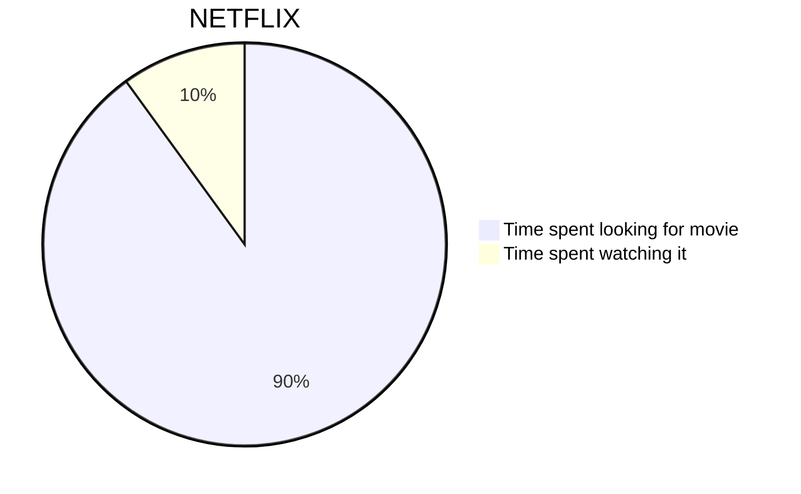

# About test-writerside0



<code-block lang="GO">
func test() {
    fmt.Println("Hello World!")
}
</code-block>
```
fn main() {
    println!("Hello World!")
}
```

```Python
print("Hello World!")
```

